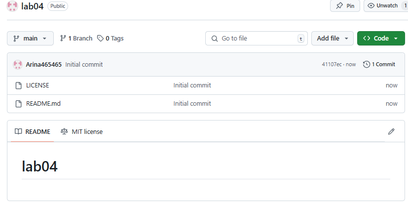
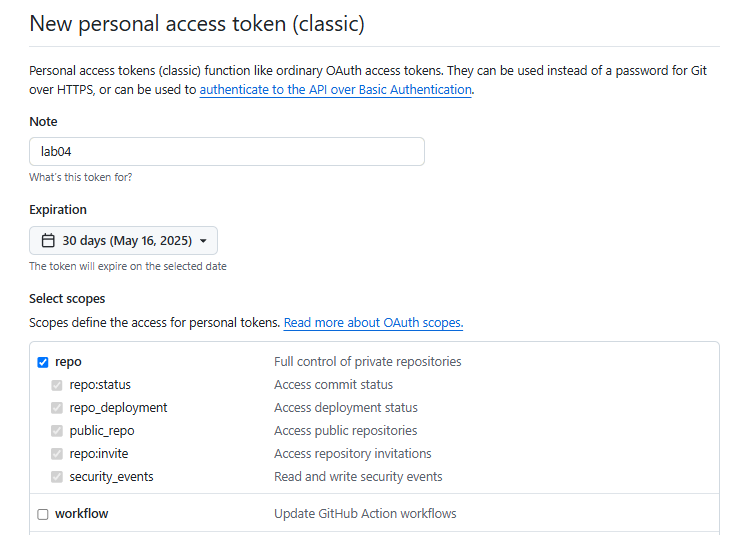
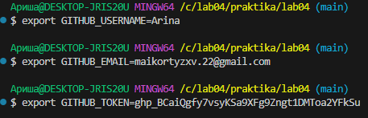
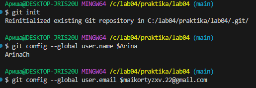
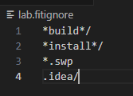
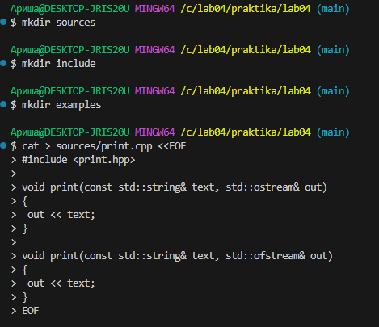
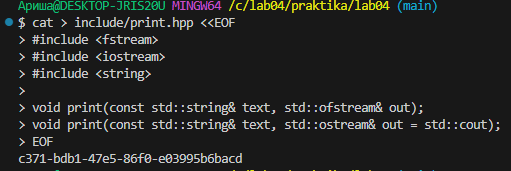
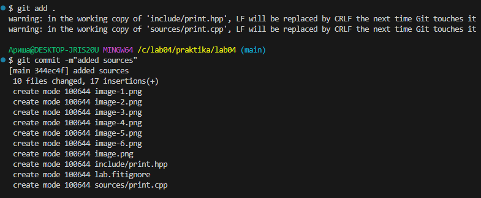
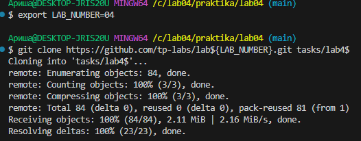

# lab04
1. Создайте публичный репозиторий с названием **lab04** и лицензией **MIT**

2. Сгенерировать токен для доступа к сервису **GitHub** с правами репозитория

**Tutorial**
```bash
$ export GITHUB_USERNAME=<имя_пользователя>
$ export GITHUB_EMAIL=<адрес_почтового_ящика>
$ export GITHUB_TOKEN=<сгенирированный_токен>
$ alias edit=<nano|vi|vim|subl>
```

```bash
$ cd ${GITHUB_USERNAME}/workspace
$ source scripts/activate
```
```bash
$ mkdir ~/.config
$ cat > ~/.config/hub <<EOF
github.com:
- user: ${GITHUB_USERNAME}
  oauth_token: ${GITHUB_TOKEN}
  protocol: https
EOF
$ git config --global hub.protocol https
```
```bash
$ mkdir projects/lab04 && cd projects/lab04
$ git init
$ git config --global user.name ${GITHUB_USERNAME}
$ git config --global user.email ${GITHUB_EMAIL}
# check your git global settings
$ git config -e --global
$ git remote add origin https://github.com/${GITHUB_USERNAME}/lab04.git
$ git pull origin master
$ touch README.md
$ git status
$ git add README.md
$ git commit -m"added README.md"
$ git push origin master
```

Добавить на сервисе GitHub в репозитории lab04 файл .gitignore со следующем содержимом:
```bash
*build*/
*install*/
*.swp
.idea/
```

```bash
$ git pull origin master
$ git log
```
```bash
$ mkdir sources
$ mkdir include
$ mkdir examples
$ cat > sources/print.cpp <<EOF
#include <print.hpp>

void print(const std::string& text, std::ostream& out)
{
  out << text;
}

void print(const std::string& text, std::ofstream& out)
{
  out << text;
}
EOF
```

```bash
$ cat > include/print.hpp <<EOF
#include <fstream>
#include <iostream>
#include <string>

void print(const std::string& text, std::ofstream& out);
void print(const std::string& text, std::ostream& out = std::cout);
EOF
```

```bash
$ cat > examples/example1.cpp <<EOF
#include <print.hpp>

int main(int argc, char** argv)
{
  print("hello");
}
EOF
```
```bash
$ cat > examples/example2.cpp <<EOF
#include <print.hpp>

#include <fstream>

int main(int argc, char** argv)
{
  std::ofstream file("log.txt");
  print(std::string("hello"), file);
}
EOF
```
```bash
$ edit README.md
```
```bash
$ git status
$ git add .
$ git commit -m"added sources"
$ git push origin master
```

**Report**
```bash
$ cd ~/workspace/
$ export LAB_NUMBER=04
$ git clone https://github.com/tp-labs/lab${LAB_NUMBER}.git tasks/lab${LAB_NUMBER}
$ mkdir reports/lab${LAB_NUMBER}
$ cp tasks/lab${LAB_NUMBER}/README.md reports/lab${LAB_NUMBER}/REPORT.md
$ cd reports/lab${LAB_NUMBER}
$ edit REPORT.md
$ gist REPORT.md
```


